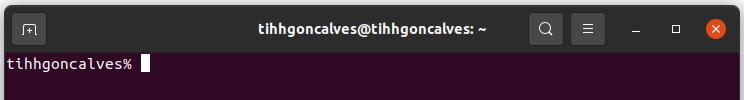
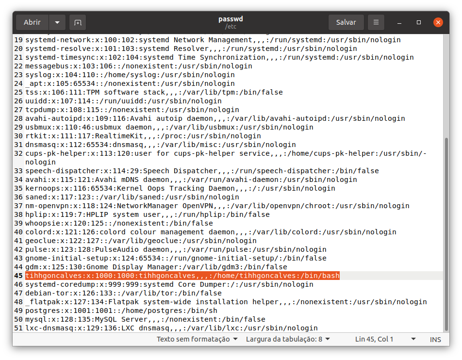
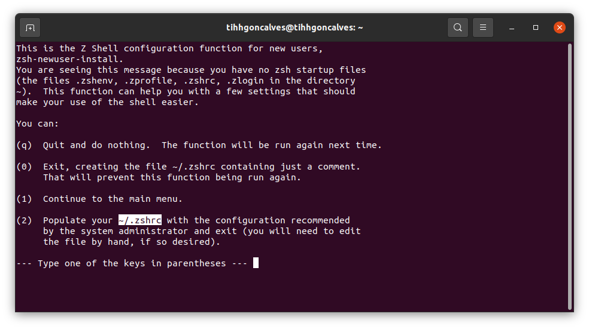
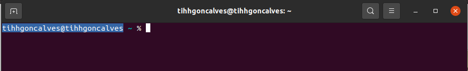
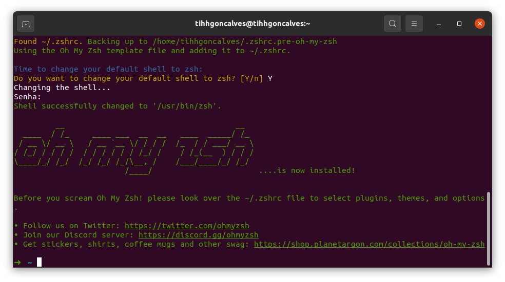
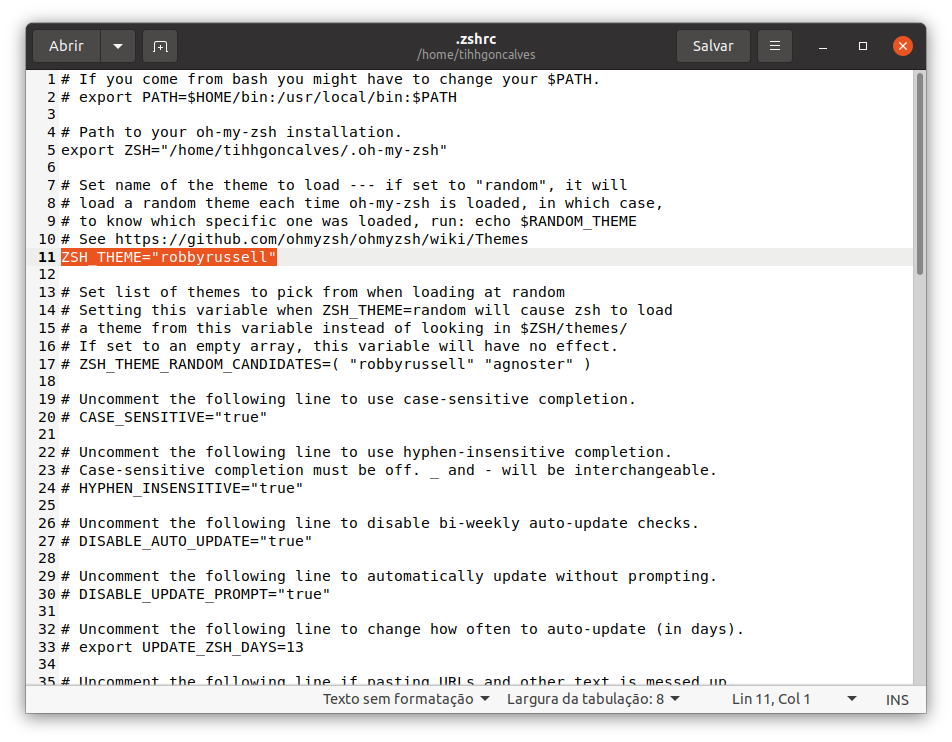
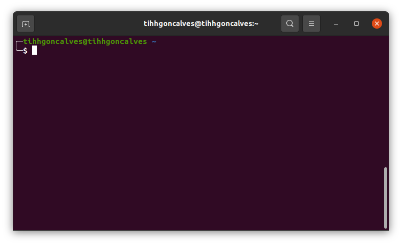

# Instalando o ZSH no Terminal

Atualmente a minha distribuição do Linux é a Ubuntu 22.04.3 LTS. Gosto bastante da interface dele, apesar de usar algumas customizações para deixá-lo mais minimalista.

Porém, uma coisa que eu sempre gosto de trocar é o Terminal. Acho o `bash` bastante bonito até, mas tem um outro terminal que me agrada mais e é ele que vou mostrar pra você nesse artigo, além de te ajudar a instalá-lo também, pra você não ficar na vontade, hehe.

Então quero apresentar pra você o **ZSH**, um *shell* com vários recursos interessantes para *power users*.

## Instalando o ZSH

O ZSH já está disponível no repositório da maioria das distribuições Linux, então fica fácil de você instalar ele, mas caso você queria fazer de forma manual, [há também a página no GitHub dele](https://github.com/robbyrussell/oh-my-zsh), lá você encontra informações sobre um projeto chamado "Oh My ZSH!" que vai turbinar o seu ZSH ainda mais, caso você queria extrair ainda mais do potencial da ferramenta.

No Ubuntu o processo de instalação via terminal é assim:

```
sudo apt install zsh
```

Pronto! O ZSH já estará instalado no seu linux.

Como ao abrir o seu terminal você provavelmente estará utilizando o `bash`, então para mudar para o `ZSH`é só digitar:

```
zsh
```

O estilo do seu terminal mudou, certo? Ao invés de você ter o popular `$` indicando o seu usuário comum, agora você tem um símbolo percentual. No caso de usar o `root`, tanto Bash, quanto ZSH vão exibir o tradicional `#`.

Aparecerá algo parecido com isso:




## Configurando o ZSH como shell padrão

O ZSH já está instalado, mas digamos que você gostaria que sempre que abrisse o terminal, o ZSH já iniciasse sozinho (sem ter que digitar o `zsh` pra ele abrir). 

Pra fazer isso é bem simples. Vamos editar o arquivo `/etc/passwd`. Vou utilizar o gedit (editor de texto padrão do Ubuntu), mas fique à vontade para utilizar o que você mais gosta.

```
sudo gedit /etc/passwd
```

Dentro do arquivo, procure pela linha que começa com o seu nome de usuário. No meu caso, o meu usuário é *tihhgoncalves*, encontrei ele na linha 45:



No final dessa linha com o seu usuário, terá um `:bin/bash` e o que precisamos fazer é trocar para `:bin/zsh`.

Depois de fazer essa alteração, salve o arquivo. Reinicie o seu computador (ou pelo menos feche a sessão do seu usuário e carregue-o novamente) para que entre em vigor essa configuração que fizemos.

Pronto! Agora se você abrir novamente o terminal, já deve vir com o ZSH carregado.

> **P.S.:** Se em algum momento você precisar voltar pro tradicional _bash_ do linux, é só digitar `bash` no terminal.

## Minha personalização

Agora que o ZSH já está instalado e configurado pra ser carregado automaticamente, vou compartilhar a minha configuração pessoal. Você pode simplesmente copiar como eu irei fazer ou usar como ponto de partida para configurar no estilo que você mais gosta.

Você já deve ter notado que sempre que o ZSH abre, ele aparece uma tela que você precisa dar um ENTER pra continuar. Uma tela como essa:


Conforme indicado no próprio texto que aparece, pra que essa introdução não apareça mais, você precisará criar um arquivo `~/.zshrc` Você pode dizer pra ele criar automaticamente teclando o número 2.

Você vai reparar que automaticamente o estilo vai já dar uma melhorada:


Agora já temos configurado um arquivo que nos permite customizar o ZSH. E eu gosto de utilizar um projetinho legal chamado "OH MY ZSH" que vai te permitir customizar um monte de coisa no ZSH. Você pode dar uma olhada  [no GitHub do OH MY ZSH](https://github.com/ohmyzsh/ohmyzsh).

Abrindo o repositório, lá terá as instruções de como instalar ele. Considerando que no Ubuntu vem instalado por padrão o `wget`, instalarei utilizando essa opção da documentação. É só digitar no terminal:

```
sh -c "$(wget -O- https://raw.githubusercontent.com/ohmyzsh/ohmyzsh/master/tools/install.sh)" 
```

> **P.S.:** Talvez você não tenha o `git` instalado. Então se precisar instalá-lo, é só utitlizar essa comando antes: `sudo apt install git`

Você vai notar que novamente o estilo irá mudar. Ficará algo assim:


Agora vamos voltar naquele arquivo de customização do ZSH:

```
sudo gedit ~/.zshrc
```

Dentro do arquivo procure pela linha que tem o "ZSH_THEME":


Nessa linha, você poderá escolher qual tema deseja utilizar. Caso você queira fazer uns testes, ele já baixou no seu computador um monte de temas, que você poderá encontrar nesse diretório: `~/.oh-my-zsh/themes`

Você pode também dar uma espiada na documentação desses temas, que já vem com um print e tudo mais. É só [acessar aqui](https://github.com/ohmyzsh/ohmyzsh/wiki/Themes).

O tema que eu gosto de usar é o "bira", então meu arquivo de configuração coloquei assim: 

```
ZSH_THEME="bira"
```

E txaram! Aqui está o meu terminal:


## Usuário root
Se vocẽ precisar utulizar o `sudo su` no seu terminal, irá perceber que o ZSH não será carregado. Para resolver isso, o primeiro passo é fazer o mesmo que você fez com o seu usuário, mas agora com o usuário `root`, dentro do arquivo `/etc/passwd`. 

Porém, somente isso não será suficiente. Para fazer que suas configurações no `root` sejam iguais as do seu usuário pessoal, precisa rodar essa linha de comando:

```
sudo su
cp -av ~/.zshrc /roo
cp -av ~/.oh-my-zsh /roo
```

Esse script irá copiar o arquivo de configuração e toda a pasta `.oh-my-zsh` pra dentro do usuário root. Lembrando que toda modificação que você fizer, terá sempre que rodar esse script pra atualizar também as modificações no usuário root.

Espero que você tenha curtido esse artigo. Deixe seu comentário me contando se você conseguiu utilizar o ZSH e me envie também um print do seu terminal.


Grande abraço! Até mais. 😎🤙🏼
